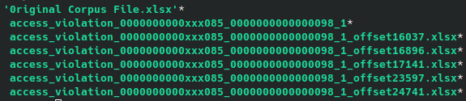

# binary_min_diff
A fuzzing helper script to generate individual, minimized crash files for further root cause analysis

### Usage:

```
binary_min_diff.py original_file fuzzed_file
```



### Note:
AFL (and variants) typically will generate crash files without the original corpus file extension. binary_min_diff adds it back in so you don't have to. This can be especially helpful if your target application expects a certain format and your crash file has many modified offsets.